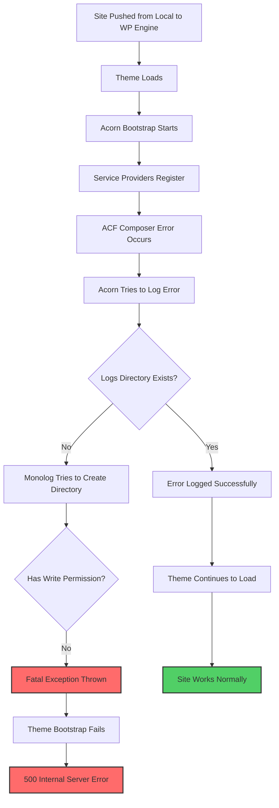
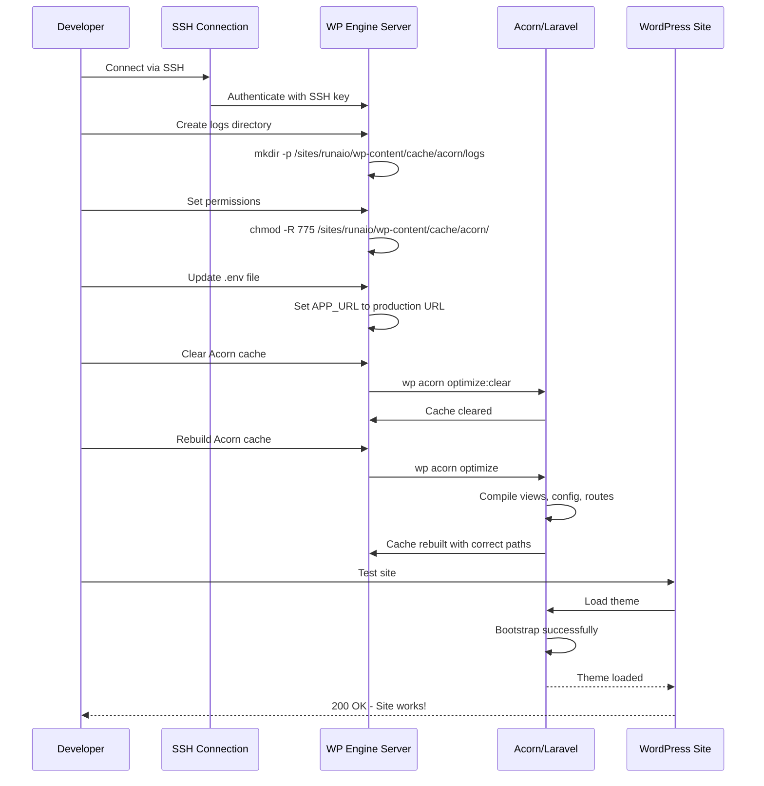
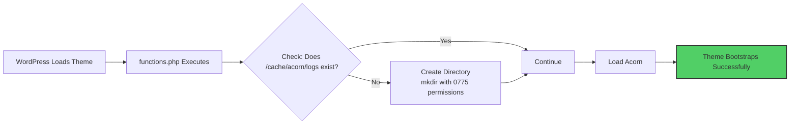
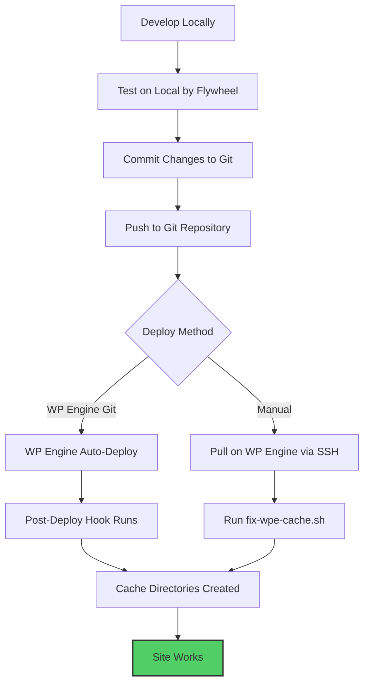
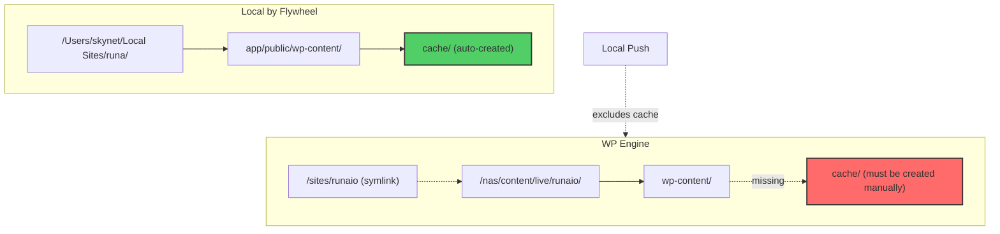
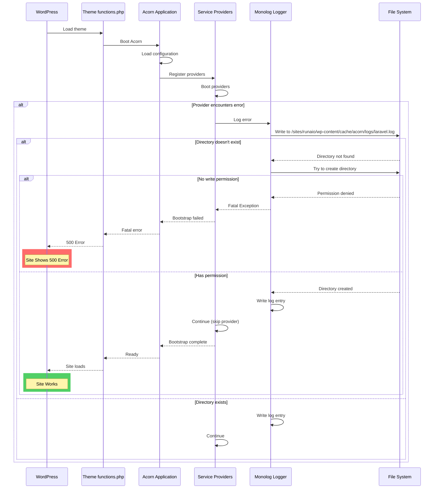

# Comprehensive Analysis: WP Engine Deployment Issue & Solution

## Executive Summary

Your Sage/Acorn WordPress theme failed on WP Engine after pushing from Local by Flywheel due to **missing cache directories** and **incorrect environment configuration**. The site returned a 500 error because Laravel's logging system (Monolog) couldn't create required log files, causing a fatal exception during theme bootstrap.

---

## The Problem: Root Cause Analysis

### Error Chain



### Primary Issues Discovered

#### 1. **Missing Cache Directory Structure** (Critical)
**Error:**
```
UnexpectedValueException: There is no existing directory at
"/sites/runaio/wp-content/cache/acorn/logs" and it could not be created: Permission denied
```

**Why It Happened:**
- Local by Flywheel and WP Engine have different file system structures
- Cache directories (`wp-content/cache/`) are typically excluded from sync/deployment
- WP Engine uses `/nas/content/live/runaio/` (aliased as `/sites/runaio/`)
- When Acorn tried to log an error, the logs directory didn't exist
- Even though Monolog tried to create it, permissions prevented automatic creation

#### 2. **Environment Configuration Mismatch** (Secondary)
**Issue:**
```php
// .env on WP Engine (incorrect)
APP_URL=https://runa.local
APP_ENVIRONMENT=development
```

**Impact:**
- Wrong base URLs could cause asset loading issues
- Development mode might have different error handling
- Not fatal but could cause undefined behavior

#### 3. **View Cache Permission Issues** (Secondary)
**Error:**
```
file_put_contents(...framework/views/9cec6b7e3fddc0305427c3aa63468031.php):
Failed to open stream: Permission denied
```

**Why:**
- Blade templates need to compile to PHP files
- Write permissions were insufficient on cache directories

---

## The Solution: Step-by-Step Fix

### What Was Done



### Commands Executed

```bash
# 1. Create the logs directory
mkdir -p /sites/runaio/wp-content/cache/acorn/logs

# 2. Set proper permissions
chmod -R 775 /sites/runaio/wp-content/cache/acorn/

# 3. Update .env file for production
echo 'APP_URL=https://runaio.wpenginepowered.com' > /nas/content/live/runaio/wp-content/themes/runa/.env
echo 'APP_ENVIRONMENT=production' >> /nas/content/live/runaio/wp-content/themes/runa/.env

# 4. Clear and rebuild cache
cd /nas/content/live/runaio
wp acorn optimize:clear
wp acorn optimize
```

---

## Prevention: Future Deployment Strategies

### Option 1: Quick Fix Script (Immediate Solution)

**When to Use:** After every Local by Flywheel push

**Implementation:**

Create a local script `~/fix-wpe-cache.sh`:

```bash
#!/bin/bash
# Fix WP Engine Acorn Cache Permissions

SITE="runaio"
SSH_KEY="~/.ssh/wpengine_rsa"

echo "🔧 Fixing cache directories on WP Engine..."

ssh -i $SSH_KEY $SITE@$SITE.ssh.wpengine.net << 'ENDSSH'
# Create cache directories
mkdir -p /sites/runaio/wp-content/cache/acorn/logs
mkdir -p /sites/runaio/wp-content/cache/acorn/framework/views
mkdir -p /sites/runaio/wp-content/cache/acorn/framework/cache

# Set permissions
chmod -R 775 /sites/runaio/wp-content/cache/acorn/

# Rebuild cache
cd /sites/runaio
wp acorn optimize:clear
wp acorn optimize

echo "✅ Cache directories created and optimized"
ENDSSH

echo "🎉 Done! Your site should be working now."
```

Make it executable:
```bash
chmod +x ~/fix-wpe-cache.sh
```

**Usage:**
```bash
# After pushing from Local to WP Engine
~/fix-wpe-cache.sh
```

**Pros:**
- ✅ Quick and easy
- ✅ No code changes needed
- ✅ Works immediately

**Cons:**
- ❌ Manual step required after each push
- ❌ Easy to forget
- ❌ Doesn't prevent the issue

---

### Option 2: Automated Directory Creation in Theme (Recommended)

**When to Use:** Permanent solution that handles it automatically

**Implementation:**

Add to `functions.php` **before** Acorn boots (around line 20-25):

```php
<?php

use Roots\Acorn\Application;

define("TEXT_DOMAIN", "runa");

/*
|--------------------------------------------------------------------------
| Ensure Required Cache Directories Exist
|--------------------------------------------------------------------------
|
| Create Acorn cache directories if they don't exist.
| This prevents fatal errors on fresh deployments.
|
*/

$acorn_cache_dirs = [
    WP_CONTENT_DIR . '/cache/acorn/logs',
    WP_CONTENT_DIR . '/cache/acorn/framework/views',
    WP_CONTENT_DIR . '/cache/acorn/framework/cache',
    WP_CONTENT_DIR . '/cache/acorn/framework/sessions',
];

foreach ($acorn_cache_dirs as $dir) {
    if (!file_exists($dir)) {
        @mkdir($dir, 0775, true);
    }
}

/*
|--------------------------------------------------------------------------
| Register The Auto Loader
|--------------------------------------------------------------------------
*/

if (! file_exists($composer = __DIR__.'/vendor/autoload.php')) {
    wp_die(__('Error locating autoloader. Please run <code>composer install</code>.', 'sage'));
}

require $composer;

// ... rest of functions.php
```

**How It Works:**



**Pros:**
- ✅ Automatic - no manual steps
- ✅ Works on every deployment
- ✅ Self-healing
- ✅ No external dependencies

**Cons:**
- ❌ Modifies theme code
- ❌ Needs to be maintained in theme

---

### Option 3: WP Engine Post-Deploy Hook (Advanced)

**When to Use:** If using WP Engine's Git deployment

**Implementation:**

Create `.wpengine-deploy.sh` in your theme root:

```bash
#!/bin/bash
# WP Engine Post-Deploy Hook

# Ensure cache directories exist
mkdir -p wp-content/cache/acorn/logs
mkdir -p wp-content/cache/acorn/framework/views
mkdir -p wp-content/cache/acorn/framework/cache
mkdir -p wp-content/cache/acorn/framework/sessions

# Set permissions
chmod -R 775 wp-content/cache/acorn/

# Clear old cache
if command -v wp &> /dev/null; then
    wp acorn optimize:clear --allow-root
    wp acorn optimize --allow-root
fi

echo "✅ Acorn cache directories initialized"
```

Make it executable:
```bash
chmod +x .wpengine-deploy.sh
```

**WP Engine Setup:**
1. Push this file to your Git repo
2. WP Engine automatically executes it after Git deploy
3. No manual intervention needed

**Pros:**
- ✅ Fully automated with Git deployments
- ✅ Runs on every deploy
- ✅ Separated from theme code
- ✅ Infrastructure-as-code approach

**Cons:**
- ❌ Only works with WP Engine Git deployment
- ❌ Doesn't work with Local by Flywheel push
- ❌ Requires Git workflow

---

### Option 4: Use Git Instead of Local Push (Best Practice)

**Recommended Workflow:**



**Setup:**

1. **Initialize Git in your theme:**
```bash
cd /Users/skynet/Local\ Sites/runa/app/public/wp-content/themes/runa
git init
git add .
git commit -m "Initial commit"
```

2. **Add `.gitignore`:**
```gitignore
# Compiled assets
/public/build
/node_modules

# Cache (but keep structure)
/wp-content/cache/*
!/wp-content/cache/.gitkeep

# Environment files
.env
.env.*
!.env.example

# OS files
.DS_Store
Thumbs.db
```

3. **Create cache structure placeholders:**
```bash
mkdir -p wp-content/cache/acorn/logs
touch wp-content/cache/acorn/logs/.gitkeep
git add -f wp-content/cache/acorn/logs/.gitkeep
```

4. **Connect to GitHub/GitLab:**
```bash
git remote add origin <your-repo-url>
git push -u origin main
```

5. **Configure WP Engine Git Push:**
   - Go to WP Engine Dashboard → Your Site → Git Push
   - Add your repository
   - WP Engine will auto-deploy on push

**Pros:**
- ✅ Version control for all changes
- ✅ Rollback capability
- ✅ Team collaboration
- ✅ Automated deployments
- ✅ Better than Local push

**Cons:**
- ❌ More setup initially
- ❌ Learning curve for Git
- ❌ Requires repository hosting

---

## Technical Deep Dive: Why This Happened

### File System Architecture Differences



**Local by Flywheel:**
- Development environment
- Full file system access
- Auto-creates directories as needed
- Permissive file permissions (usually 777)

**WP Engine:**
- Production environment
- Restricted file system access
- Strict permissions for security
- Cache directories excluded from sync
- Uses symlinks (`/sites/` → `/nas/content/live/`)

### Acorn/Laravel Bootstrap Process



### Permission Requirements

| Directory | Required Permission | Purpose |
|-----------|-------------------|---------|
| `/wp-content/cache/` | `775` (rwxrwxr-x) | Base cache directory |
| `/wp-content/cache/acorn/` | `775` | Acorn cache root |
| `/wp-content/cache/acorn/logs/` | `775` | **Critical:** Log files |
| `/wp-content/cache/acorn/framework/views/` | `775` | Compiled Blade templates |
| `/wp-content/cache/acorn/framework/cache/` | `775` | Config/route cache |
| `/wp-content/cache/acorn/framework/sessions/` | `775` | Session storage |

**Why 775?**
- `7` (rwx) - Owner (wpe-user) can read/write/execute
- `7` (rwx) - Group (wpe-user) can read/write/execute
- `5` (r-x) - Others can read/execute but not write

---

## Comparison of Solutions

| Solution | Automation | Reliability | Setup Complexity | Maintenance | Best For |
|----------|------------|-------------|------------------|-------------|----------|
| **Quick Fix Script** | Manual | Medium | Low | None | Quick testing, occasional deploys |
| **Theme Code Fix** | Automatic | High | Low | Low | Production sites, frequent deploys |
| **WP Engine Hook** | Automatic | High | Medium | Low | Git-based deployments |
| **Git Workflow** | Automatic | Very High | High | Medium | Professional development, teams |

---

## Recommended Implementation Strategy

### Phase 1: Immediate Fix (Today)
1. ✅ Site is working now (logs directory created)
2. Run the quick fix script after each Local push

### Phase 2: Short-term Solution (This Week)
1. Add directory creation code to `functions.php` (Option 2)
2. Test deployment from Local
3. Verify automatic directory creation works

### Phase 3: Long-term Solution (Next Sprint)
1. Migrate to Git-based workflow
2. Set up WP Engine Git Push
3. Add post-deploy hooks
4. Document process for team

---

## Key Takeaways

1. **Root Cause:** Missing `/wp-content/cache/acorn/logs/` directory with write permissions
2. **Why It Failed:** Local by Flywheel excludes cache directories from sync
3. **Why It Works Now:** Manually created directory with correct permissions
4. **Will It Happen Again:** Yes, unless you implement one of the prevention options
5. **Best Solution:** Add directory creation to `functions.php` + migrate to Git workflow

The issue is **environmental** (Local vs WP Engine file system differences), not a code bug. Your theme is fine—it just needs the proper cache structure on WP Engine.

---

## Quick Reference Commands

### SSH Connection
```bash
ssh runaio@runaio.ssh.wpengine.net
```

### Fix Cache Directories Manually
```bash
ssh runaio@runaio.ssh.wpengine.net "mkdir -p /sites/runaio/wp-content/cache/acorn/logs && chmod -R 775 /sites/runaio/wp-content/cache/acorn/ && cd /sites/runaio && wp acorn optimize:clear && wp acorn optimize"
```

### Check Logs
```bash
ssh runaio@runaio.ssh.wpengine.net "tail -50 /sites/runaio/wp-content/cache/acorn/logs/laravel.log"
```

### Clear Acorn Cache
```bash
ssh runaio@runaio.ssh.wpengine.net "cd /sites/runaio && wp acorn optimize:clear"
```

### Rebuild Acorn Cache
```bash
ssh runaio@runaio.ssh.wpengine.net "cd /sites/runaio && wp acorn optimize"
```

---

**Document Version:** 1.0
**Date:** October 16, 2025
**Site:** runaio.wpenginepowered.com
**Status:** ✅ Resolved
